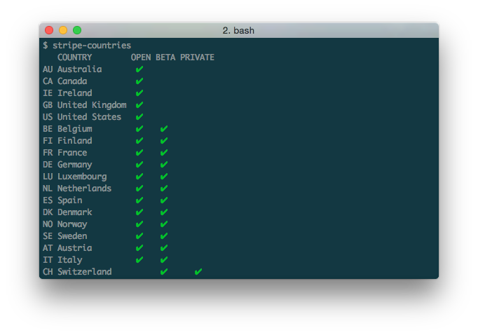

# stripe-countries [](https://travis-ci.org/matiassingers/stripe-countries) [](https://gemnasium.com/matiassingers/stripe-countries)
> list of countries + status that Stripe is available in





## Install

```sh
$ npm install --save stripe-countries
```


## Usage

```js
var stripeCountries = require('stripe-countries');

stripeCountries(function(countries){
  console.log(countries);
  // => [ { country: 'Australia', ...
})

```


## CLI

```sh
$ npm install --global stripe-countries
```

```sh
$ stripe-countries --help

  Example
    stripe-countries

    =>     COUNTRY        OPEN BETA PRIVATE
        AU Australia       ✔
        CA Canada          ✔
        CH Switzerland          ✔      ✔
    
```


## License

MIT © [Matias Singers](http://mts.io)
